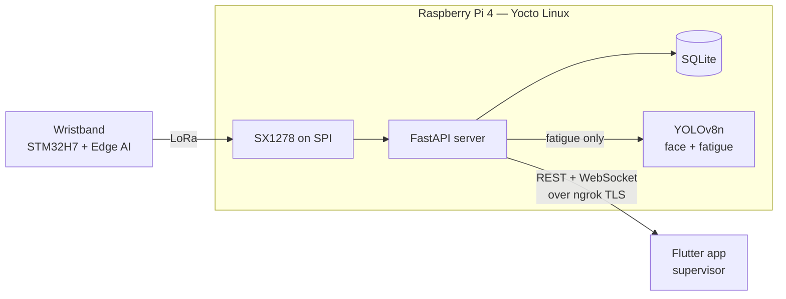
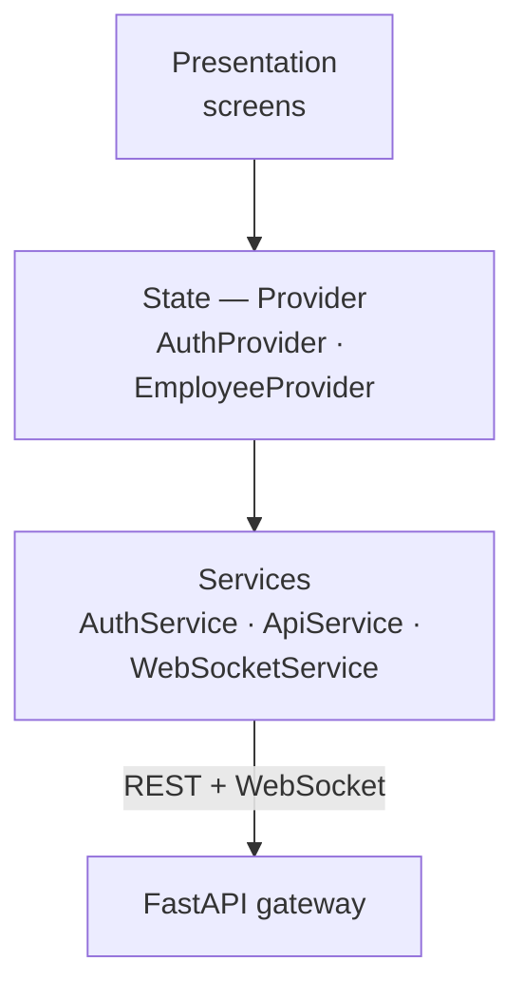

# Fatigue Monitoring — Gateway Server & Mobile App

Real-time supervision of workers' fatigue. A **FastAPI server** running on a Raspberry Pi 4 gateway receives
the fatigue states sent over LoRa by the wristbands, confirms fatigue alerts with **two YOLOv8n models**, and
pushes every event over WebSocket to a **Flutter app** used by the supervisor.

> Final-year engineering project (ENICarthage, Tunisia) carried out remotely for
> **Luleå University of Technology (Sweden)**, 2026.

---

## Highlights

| Metric                                                  | Value                                                                                |
| ------------------------------------------------------- | ------------------------------------------------------------------------------------ |
| Latency database → phone (18 measurements)              | **1.45 s on average** (0.69 – 2.12 s)                                                |
| Visual confirmation trigger rate                        | **100 %** (214/214, no false trigger or miss)                                        |
| Face detection (YOLOv8n, INT8)                          | F1 = 93.6 %                                                                          |
| Fatigue / no-fatigue classification (YOLOv8n-cls, INT8) | F1 = 96.9 %                                                                          |
| Security                                                | JWT · Argon2 · account lockout · rate limiting · Fail2ban · TLS · encryption at rest |

---

## System overview



| Repository                                                                                                | Content                                                            |
| --------------------------------------------------------------------------------------------------------- | ------------------------------------------------------------------ |
| [edge.ai-wearable-fatigue-detection](https://github.com/aziz-hadjayed/edge.ai-wearable-fatigue-detection) | Edge AI model: benchmark, distillation, STM32 deployment           |
| [yocto-fatigue-monitoring](https://github.com/aziz-hadjayed/yocto-fatigue-monitoring)                     | Custom Yocto layer that packages this server on the Raspberry Pi 4 |
| **FATIGUE_MONITORING_MOBILE_APP** (this repo)                                                             | FastAPI backend (`backend/`) and Flutter app (`frontend/`)         |

---

## Backend — FastAPI gateway server

- **Routers:** `auth` (accounts, login, password reset), `employees` (CRUD, history, connection status), `ws` (real-time stream).
- **LoRa reception** runs in a background thread inside the FastAPI lifecycle. Because the SPI bus needs exclusive access,
  the server runs with a single Uvicorn worker.
- **Storage:** SQLAlchemy + SQLite. Three entities: `Admin` (supervisors), `Employee` (linked to a wristband ID) and fatigue events.
- **Visual confirmation:** only fatigue events trigger the camera pipeline — a YOLOv8n face detector, then a
  YOLOv8n-cls fatigue / no-fatigue classifier, both quantized to INT8 for the Raspberry Pi CPU.
- **Connection status** per employee, from the age of the last frame: online (< 2 min), away (< 15 min), offline.

### Security — defense in depth

| Layer            | Mechanism                                                                                                       |
| ---------------- | --------------------------------------------------------------------------------------------------------------- |
| Network exposure | Server bound to `127.0.0.1` only; public access through an ngrok TLS tunnel (no open port on the router)        |
| Authentication   | JWT (HTTPBearer); passwords hashed with Argon2                                                                  |
| Brute force      | Account locked 15 min after 3 failed logins + Fail2ban jails (SSH and API) banning IPs through nftables         |
| Abuse            | Sliding-window rate limiting (60 requests / min / IP → HTTP 429)                                                |
| HTTP hardening   | Security headers (HSTS, X-Frame-Options, …) and CORS restricted to the deployment domain                        |
| Data at rest     | Personal fields encrypted; reset tokens hashed, valid 10 min, identical response to prevent account enumeration |
| Privileges       | Service runs as an unprivileged `fastapi` user, auto-restart on failure (systemd)                               |
| Traceability     | Rotating logs (401 / 429 included) feeding Fail2ban                                                             |

---

## Frontend — Flutter supervisor app

Three-layer architecture:



- **Services:** REST calls authenticated with a Bearer token; the WebSocket service **reconnects automatically**
  and uses a **heartbeat** to detect silent disconnections.
- **State:** `Provider` (`ChangeNotifierProvider`) — screens never call the network directly.
- **Navigation:** `go_router`, with deep links to an employee page and to the password-reset flow.

### Features

- **Account management:** sign-up, login, password recovery by e-mail token, profile editing.
- **Employee management:** search, add (wristband ID, name, role), delete with confirmation, live connection status.
- **Real-time timeline:** each employee's states (active, rest, pre-fatigue, fatigue) shown as colored bars,
  8 zoom levels from 30 s to 1 h, live statistics, and a marker on visually confirmed fatigue events.
- **Local fatigue alert:** push notification when ≥ 70 % of the events of the last 15 minutes are fatigue.
- **Vigilance index:** compares the employee's actual states with the expected ones during working hours.

---

## Getting started

### Mobile app

```bash
cd frontend
flutter pub get
flutter run
```

Set the gateway URL (ngrok domain) in the app configuration before running.

### Backend (local development)

```bash
cd backend
pip install -r requirements.txt
cp .env.example .env        # fill in your own secrets (JWT key, SMTP, ...)
uvicorn app.main:app --host 127.0.0.1 --port 8000
```

On the real gateway, the server is built into the Linux image by the
[Yocto layer](https://github.com/aziz-hadjayed/yocto-fatigue-monitoring) and started as a systemd service.

---

## Tech stack

**Backend:** Python · FastAPI · Uvicorn · SQLAlchemy · SQLite · WebSocket · JWT (python-jose) · Argon2 (passlib) · YOLOv8n · TensorFlow Lite · LoRa SX1278 (SPI)
**Mobile:** Flutter · Dart · Provider · go_router · WebSocket
**Infrastructure:** Raspberry Pi 4 · Yocto Linux · systemd · ngrok · Fail2ban · nftables

---

## Author

**Mohamed Aziz Hadjayed** — Edge AI engineer, ENICarthage
[LinkedIn](https://www.linkedin.com/in/mohamedaziz-hadjayed/) · [GitHub](https://github.com/aziz-hadjayed)
